# Travel Planner App - GraphQL-based in TypeScript

The Travel Planner App is a web application that allows users to plan and organize their trips efficiently. It utilizes GraphQL as the API layer and is implemented using TypeScript for a more robust and type-safe development experience. With this app, users can create trip itineraries, search for points of interest, and share their travel plans with others.

## Features

- **User Authentication:** Users can sign up, log in, and manage their accounts.
- **Trip Creation:** Users can create new trips, specifying the destination, dates, and other details.
- **Itinerary Management:** Users can add, remove, and update notes within their trip itinerary.
- **Collaboration:** Users can share their trip plans with other registered users.
- **Real-time Updates:** Utilize GraphQL subscriptions for real-time updates when collaborating on a trip.

## Technologies Used

- **GraphQL:** For the API layer, enabling efficient data retrieval and mutation.
- **TypeScript:** For a type-safe and more maintainable codebase.
- **Apollo Client:** For handling GraphQL queries, mutations, and subscriptions on the client-side.
- **Node.js:** For the backend server implementation.
- **Nestjs:** a popular open-source, back-end framework for Node. js and TypeScript-based, server-side applications.
- **MongoDB:** As the database for storing user accounts, trips, and other data.
- **Mongoose:** For modeling the MongoDB data and performing database operations.

## Getting Started

### Prerequisites

- Node.js and npm should be installed on your machine.

- MongoDB server should be running locally or have a connection to a remote MongoDB instance.

### Installation

- Clone the repository: `git clone https://github.com/basemax/TravelPlannerGraphQLTS.git`
- Navigate to the project directory: `cd TravelPlannerGraphQLTS`
- Install dependencies for the server:

```bash
cd server
npm install
```

**Configure the environment variables:**

Create a .env file in the server directory and provide the necessary configuration, such as MongoDB connection URL and JWT secret key.

**Seed the database (optional):**

If you want to add some sample data to the database, you can use the provided seed script:

```bash
cd server
npm run seed
```

```
npm start
```

Access the app in your browser at `http://localhost:3000`.

## GraphQL

### Queries:

- `getUser`: Get user details by user ID or username.
- `getTrip`: Get trip details by trip ID.
- `getTripsByUser`: Get all trips associated with a specific user.
- `getCollaborators`: Get a list of users who are collaborators on a specific trip.
- `getCollaboratorTrips`: Get all trips where the current user is a collaborator.
- `searchTrips`: Search for trips based on destination, date range, or other criteria.
- `getPopularDestinations`: Get a list of popular destinations based on the number of trips created.
- `getTripsByDateRange`: Get trips that fall within a specified date range.
- `getTripsByDestination`: Get all trips with a specific destination.
- `getTripsByDate`: Get all trips that occur on a particular date.
- `getTripsByCollaborator`: Get all trips where a specific user is a collaborator.

### Mutations:

- `signup`: Create a new user account with username, email, and password.
- `login`: Log in the user and return a JWT token for authentication.
- `createTrip`: Create a new trip with destination, dates, and other details.
- `updateUser`: Update user details, such as name, email, or profile picture.
- `updateTrip`: Update trip details, such as destination, dates, or other information.
- `addCollaborator`: Invite a user to collaborate on a trip by adding them to the list of collaborators.
- `removeCollaborator`: Remove a collaborator from a trip.
- `deleteUser`: Delete the user account along with all associated data (trips, activities, etc.).
- `deleteTrip`: Delete a trip along with its itinerary and associated data.
- `addCollaboratorNote`: Allow collaborators to add notes or comments to a specific trip.
- `editCollaboratorNote`: Allow collaborators to edit their notes or comments on a trip.
- `deleteCollaboratorNote`: Allow collaborators to delete their notes or comments on a trip.

### Subscriptions (Real-time Updates):

- `tripUpdated`: Subscribe to real-time updates when a trip is modified (e.g., itinerary changes, new collaborators).
- `collaboratorAdded`: Subscribe to real-time updates when a new collaborator is added to a trip.
- `collaboratorRemoved`: Subscribe to real-time updates when a collaborator is removed from a trip.
- `tripDeleted`: Subscribe to real-time updates when a trip is deleted.
- `activityUpdated`: Subscribe to real-time updates when an activity is modified (e.g., details changed, time updated).
- `tripDeleted`: Subscribe to real-time updates when a trip is deleted, notifying collaborators.
- `collaboratorNoteAdded`: Subscribe to real-time updates when a collaborator adds a note to a trip.
- `collaboratorNoteEdited`: Subscribe to real-time updates when a collaborator edits their note on a trip.
- `collaboratorNoteDeleted`: Subscribe to real-time updates when a collaborator deletes their note on a trip.

Sure, here are more examples for the remaining queries, mutations, and subscriptions:

## GraphQL Examples

### **getCollaboratorTrips**: Get all trips where the current user is a collaborator.

```graphql
query UserTrips {
  userTrips {
    _id
    destination
    toDate
    collaborators
  }
}
```

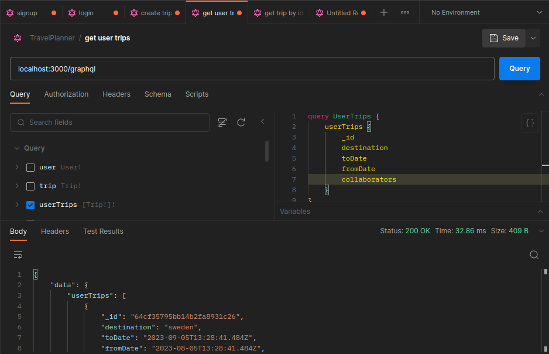

### **searchTrips**: Search for trips based on destination, date range, or other criteria.

```graphql
query {
  searchTrips(
    searchInput: {
      destination: "Italy"
      fromDate: "2023-09-01"
      toDate: "2023-09-30"
    }
  ) {
    searchTrip(searchInput: $searchInput) {
      _id
      destination
      fromDate
      toDate
      collaborators
    }
  }
}
```

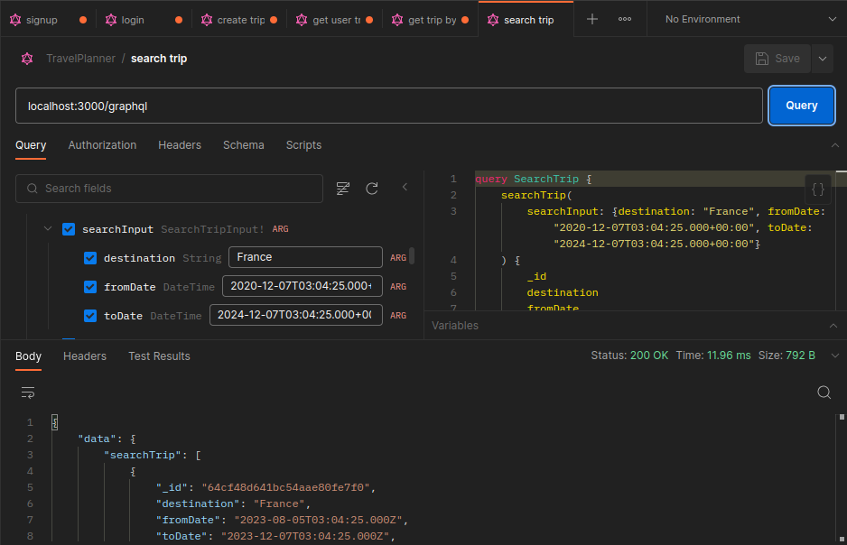

### getCollaboratorTrips: Get all trips where the current user is a collaborator.

```graphql
query {
  getCollaboratorTrips {
    id
    destination
    dates
  }
}
```

### getPopularDestinations: Get a list of popular destinations based on the number of trips created.

```graphql
query PopularDestination {
  PopularDestination {
    tripsCount
    destination
  }
}
```

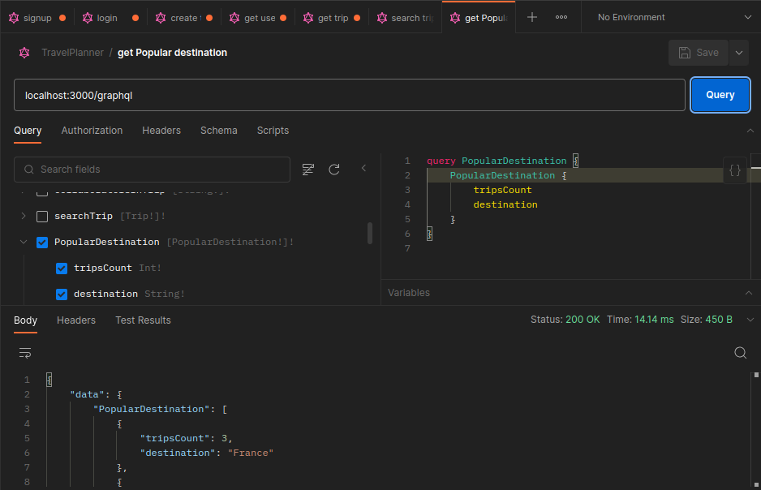

### getTripsByDateRange: Get trips that fall within a specified date range.

```graphql
query GetTripsByDateRange($dateRange: SearchTripInput!) {
  getTripsByDateRange(dateRange: $dateRange) {
    _id
    destination
    fromDate
    toDate
    collaborators
  }
}
```


### collaboratorAdded: Subscribe to real-time updates when a new collaborator is added to a trip.

```graphql
subscription {
  collaboratorAdded(tripId: "456") {
    _id
    collaborators
  }
}
```

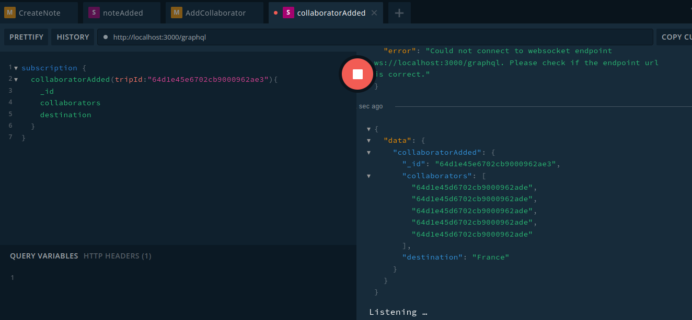

### collaboratorRemoved: Subscribe to real-time updates when a collaborator is removed from a trip.

```graphql
subscription {
  collaboratorRemoved(tripId: "456") {
    id
    collaborators
  }
}
```

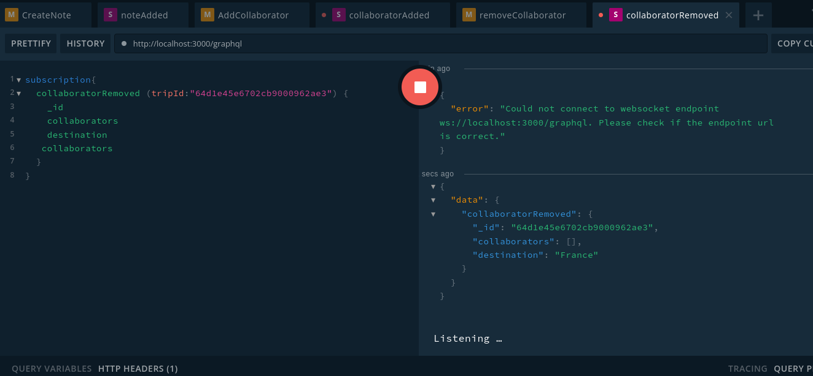

### getTripsByDestination: Get all trips with a specific destination.

```graphql
query {
  getTripsByDestination(destination: "London") {
    id
    destination
    dates
  }
}
```


### getTripsByDate: Get all trips that occur on a particular date.

```graphql
query {
  getTripsByDate(date: "2023-09-15") {
    id
    destination
    dates
  }
}
```

### addCollaboratorNote: Allow collaborators to add notes or comments to a specific trip.

```graphql
mutation CreateNote($CreateNoteInput: CreateNoteInput!) {
  createNote(createNoteInput: $CreateNoteInput) {
    _id
    notes {
      _id
      collaboratorId
      content
      createdAt
    }
    collaborators
    toDate
    fromDate
    destination
  }
}
```

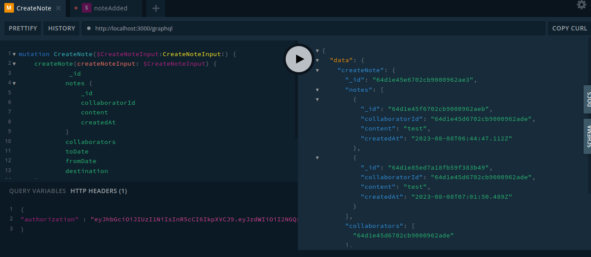

### collaboratorNoteAdded: Subscribe to real-time updates when a collaborator adds a note to a trip.

```graphql
subscription {
  collaboratorNoteAdded(tripId: "456") {
    id
    notes {
      id
      content
    }
  }
}
```

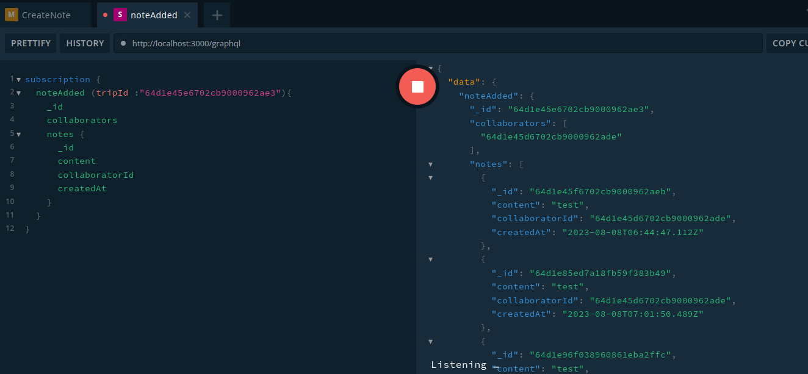

### updateCollaboratorNote: Allow collaborators to edit their notes or comments on a trip.

```graphql
mutation UpdateNote($UpdateNoteInput: UpdateNoteInput!) {
  updateNote(updateNoteInput: $UpdateNoteInput) {
    _id
    collaborators
    notes {
      _id
      content
      collaboratorId
    }
    destination
    toDate
  }
}
```

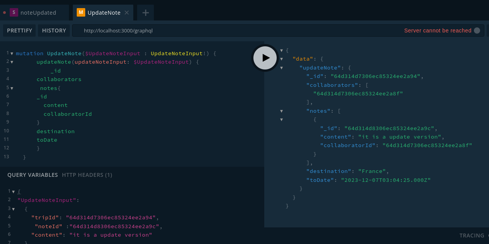

### collaboratorNoteEdited: Subscribe to real-time updates when a collaborator edits their note on a trip.

```graphql
subscription {
  collaboratorNoteEdited(tripId: "456") {
    id
    notes {
      id
      content
    }
  }
}
```


### removeCollaboratorNote: Allow collaborators to delete their notes or comments on a trip.

```graphql
mutation RemoveNote {
  removeNote(
    tripId: "64d314d7306ec85324ee2a94"
    noteId: "64d314d7306ec85324ee2a94"
  ) {
    _id
    destination
    fromDate
    toDate
    collaborators
  }
}
```

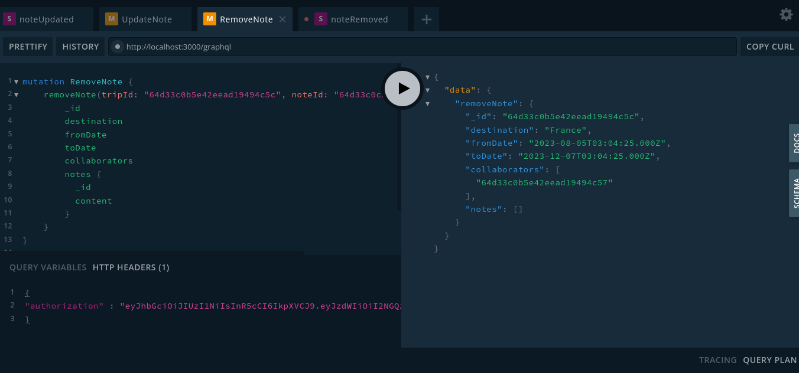

### collaboratorNoteDeleted: Subscribe to real-time updates when a collaborator deletes their note on a trip.

```graphql
subscription {
  collaboratorNoteDeleted(tripId: "456") {
    id
    notes {
      id
      content
    }
  }
}
```

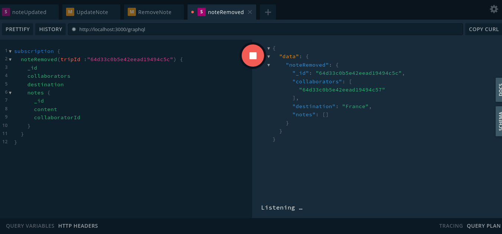

### removeTrip: remove a specific trip

```graphql
mutation RemoveTrip {
  removeTrip(id: "64d08726a580a984fb673d64") {
    _id
    destination
    fromDate
    toDate
    collaborators
  }
}
```

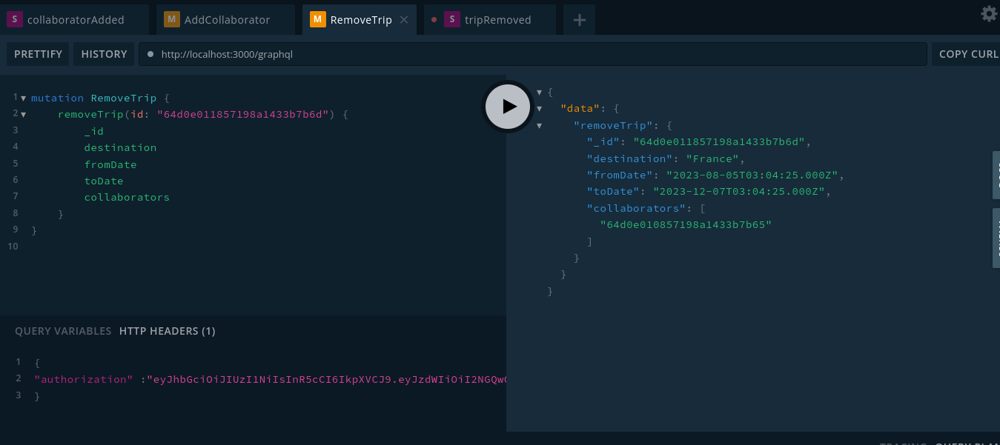

### tripRemoved: Subscribe to real-time updates when a trip is deleted.

```graphql
subscription {
  tripRemoved(tripId: "456") {
    id
    destination
    dates
  }
}
```

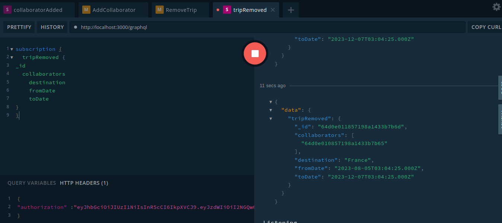

### getTripsByDate: Get all trips that occur on a particular date.

```graphql
query {
  getTripsByDate(date: "2023-09-15") {
    id
    destination
    dates
  }
}
```

### addCollaborator: Invite a user to collaborate on a trip by adding them to the list of collaborators.

```graphql
mutation {
  addCollaborator(tripId: "trip456", userId: "user789") {
    id
    destination
    collaborators {
      id
      username
    }
  }
}
```

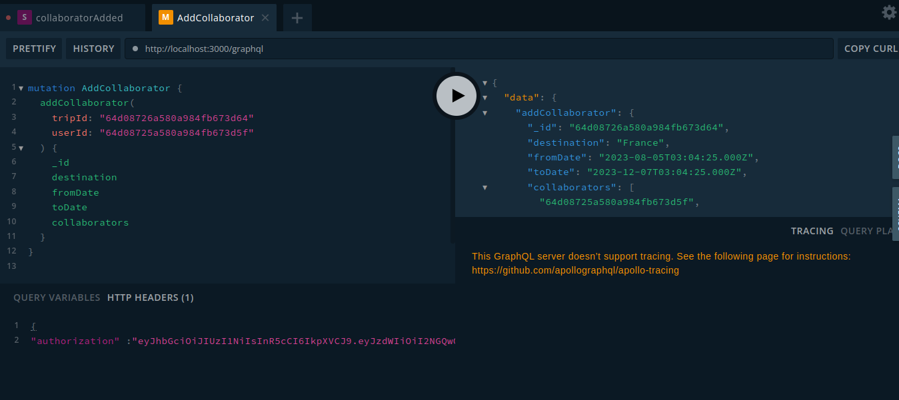

### collaboratorAdded: Subscribe to real-time updates when a new collaborator is added to a trip.

```graphql
subscription {
  collaboratorAdded(tripId: "trip456") {
    id
    destination
    collaborators {
      id
      username
    }
  }
}
```

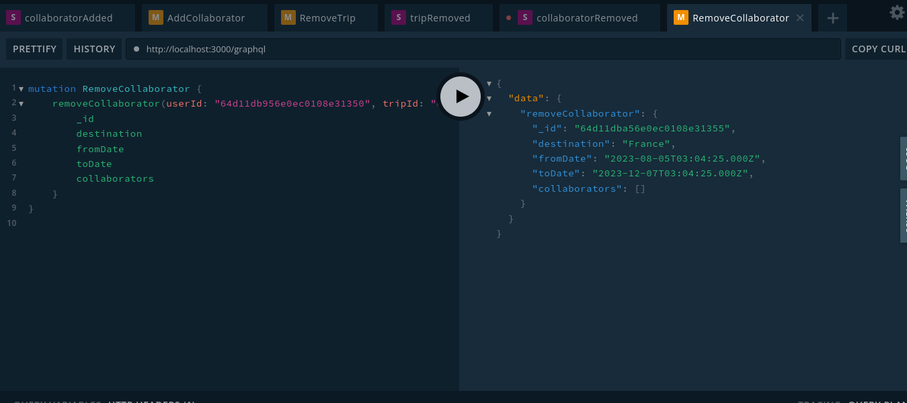

### collaboratorRemoved: Subscribe to real-time updates when a collaborator is removed from a trip.

```graphql
subscription {
  collaboratorRemoved(tripId: "trip456") {
    id
    destination
    collaborators {
      id
      username
    }
  }
}
```


## GraphQL Schema

```graphql
type User {
  id: ID!
  name: String!
  email: String!
}

type Trip {
  id: ID!
  destination: String!
  toDate: Date!
  fromDate : Date!
  notes: [User!]!
  notes: [CollaboratorNote!]!
}


type notes {
  id: ID!
  content: String!
  userId: String!
}

type Query {
  getUser(userId: ID!): User
  getTrip(tripId: ID!): Trip
  getCollaborators(tripId: ID!): [User!]!
  getCollaboratorTrips: [Trip!]!
  searchTrips(destination: String, fromDate: String, toDate: String): [Trip!]!
  getPopularDestinations: [Tag!]!
  getTripsByDateRange(fromDate: String!, toDate: String!): [Trip!]!
  getTripsByDestination(destination: String!): [Trip!]!
  getTripsByDate(date: String!): [Trip!]!
  getTripsByCollaborator(collaboratorId: ID!): [Trip!]!
}

type Mutation {
  signup(username: String!, email: String!, password: String!): User
  login(username: String!, password: String!): AuthPayload
  createTrip(input: CreateTripInput!): Trip
  addCollaborator(tripId: ID!, userId: ID!): Trip
  removeCollaborator(tripId: ID!, collaboratorId: ID!): Trip
  deleteTrip(tripId: ID!): Trip
  addCollaboratorNote(tripId: ID!, note: String!): Trip
  editCollaboratorNote(noteId: ID!, content: String!): CollaboratorNote
  deleteCollaboratorNote(noteId: ID!): CollaboratorNote
}

type Subscription {
  collaboratorAdded(tripId: ID!): User
  collaboratorRemoved(tripId: ID!): User
  tripDeleted(tripId: ID!): Trip
  collaboratorNoteAdded(tripId: ID!): CollaboratorNote
  collaboratorNoteEdited(tripId: ID!): CollaboratorNote
  collaboratorNoteDeleted(tripId: ID!): CollaboratorNote
}

type AuthPayload {
  token: String!
  name : String!
}
```

## Contributing

We welcome contributions to improve this Travel Planner App! To contribute, please follow these steps:

- Fork the repository.
- Create a new branch for your feature or bug fix: git checkout -b my-feature
- Make your changes, and ensure the code passes the tests (if available).
- Commit your changes: git commit -m "Add my feature"
- Push to your branch: git push origin my-feature
- Submit a pull request to the main branch of the original repository.

## License

This project is licensed under the GPL-3.0 License. See the LICENSE file for more details.

## Acknowledgments

Special thanks to the GraphQL and TypeScript communities for providing great tools and resources.

Copyright 2023, Max Base
